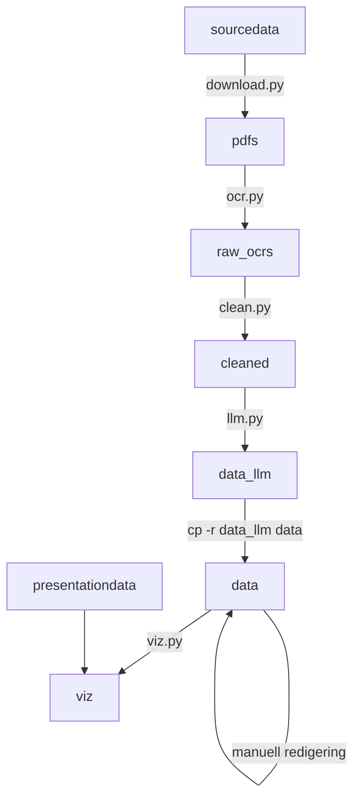

# Tekstscanning av Norsk FugleAtlas

Dette repoet inneholder skript for å laste ned PDFer fra https://www.birdlife.no/fuglekunnskap/fugleatlas/ og konvertere dem til tekstfiler.

1. `download.py` laster ned alle PDF-filene
2. `ocr.py` konverterer PDF-filene til tekstformat
3. `clean.py` renser opp tekstfilene
4. `llm.py` utfører analyse med en språkmodell
5. dataene er sjekket inn og korrigert manuelt.
6. `viz.py` plotter trekk- og hekketider for artene.



Sluttresultatet er dette (OBS: data er ikke gjennomgått for riktighet!): https://github.com/jonathangjertsen/fugleatlas/blob/master/bird_timeline.svg

## Detaljer om skriptene

### `download.py`

Laster ned filer fra birdlife.no til mappen `pdfs`.

Jeg hentet manuelt ut listen over arter og tilhørende ID ved å se på HTML-kilden for "velg art" på nettsiden. Listen er å finne i `sourcedata/species.csv`, det er også denne som brukes av `download.py`

Skriptet krever pakken `requests`

### `ocr.py`

Kjører tekstgjenkjenning på PDF-filene og oppretter tekstfiler i mappen `raw_ocrs`.

Tekstgjennkjenning (OCR) krever installasjon av tesseract med norsk språkpakke.

https://tesseract-ocr.github.io/tessdoc/Installation.html

Hvis du har Linux med apt:

```sh
sudo apt install tesseract-ocr libtesseract-dev tesseract-ocr-nor
```

I tillegg kreves Python-pakkene `pdf2image` og `pytesseract`.

### `clean.py`

OCR gjør det meste riktig, men det er noen feil, for eksempel blir `fôr` konsekvent til `för`. Dette skriptet finner slike ting og fikser. Her gjøres også manuelle fikser for ting jeg fant da jeg leste gjennom filene.

### `llm.py`

Bruker en språkmodell til å hente ut informasjon fra artiklene.

Krever miljøvariabelen `OPENAI_API_KEY` og pakken `openai`.

Du må også ha noen API credits, men ikke så mye. Pr. september 2025 koster det $0.3 å kjøre gjennom alle artiklene, så ca 2 amerikanske grunker hvis du vil kjøre det for hver landsdel (ikke støttet - rediger i så fall instruksjonene i kildekoden).

### `viz.py`

Genererer kalender-plakat for når de forskjellige fuglene kommer, har egg og har unger i Oslo og omegn.
